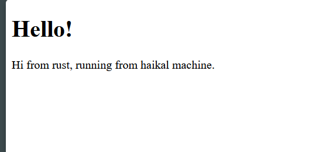
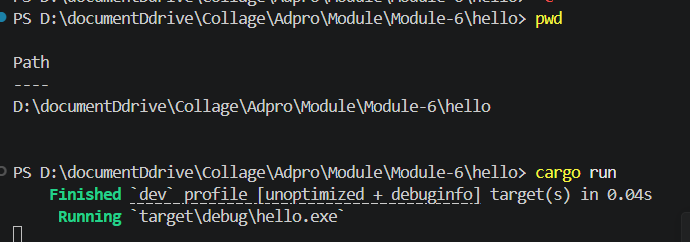
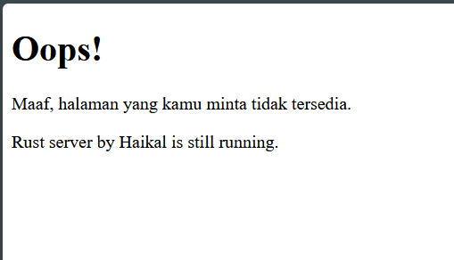
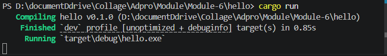

# Commit 1 Reflection Notes

Pada milestone ini saya mempelajari bagaimana server Rust single-threaded menerima koneksi dari browser menggunakan `TcpListener` lalu memproses setiap koneksi melalui `handle_connection` dengan `TcpStream` dan `BufReader`, sehingga request HTTP dapat dibaca per baris menggunakan `.lines()`, dikumpulkan sampai baris kosong sebagai penanda akhir header, dan ditampilkan ke terminal untuk verifikasi; dari proses ini saya memahami bahwa meskipun server belum mengirim body response, server sudah dapat menangkap struktur request nyata dari browser (seperti method, path, host, dan header lain), serta menyadari bahwa log koneksi bisa muncul lebih dari sekali karena perilaku retry dari browser, sehingga langkah ini menjadi fondasi penting sebelum melanjutkan implementasi response HTTP yang lengkap.

# Commit 2 Reflection Notes

# Commit 3 Reflection Notes

Pada milestone ini saya memvalidasi request agar server tidak selalu mengembalikan halaman yang sama, yaitu dengan mengambil `request_line` pertama lalu melakukan pemisahan respons menggunakan tuple `(status_line, filename)` sehingga jika request adalah `GET / HTTP/1.1` server mengirim `200 OK` dengan `hello.html`, sedangkan request lain seperti `/bad` akan mendapat `404 NOT FOUND` dengan `404.html`; refactoring ini penting karena logika pemilihan status dan file dipusatkan di satu tempat, mengurangi duplikasi saat membangun response (`Content-Length` dan body tetap diproses sekali), membuat alur kode lebih jelas untuk dikembangkan ke routing yang lebih banyak, dan memastikan perilaku server lebih realistis sesuai prinsip dasar HTTP.

# Commit 4 Reflection Notes

Pada milestone ini saya menambahkan simulasi respons lambat dengan menangani endpoint `GET /sleep HTTP/1.1` yang menjalankan `thread::sleep(Duration::from_secs(10))` sebelum mengirim response, dan dari percobaan membuka beberapa request bersamaan saya memahami bahwa server single-threaded hanya memproses satu koneksi pada satu waktu sehingga ketika satu request lambat berjalan, request lain ikut tertahan (blocking); hal ini menunjukkan keterbatasan arsitektur single thread untuk beban concurrent user dan menjadi alasan kuat kenapa refactor ke multithread/thread pool diperlukan agar request cepat tidak ikut menunggu request berat.

# Commit 5 Reflection Notes

Pada milestone ini saya memigrasikan server dari single-thread ke multithread dengan `ThreadPool` berisi beberapa `Worker` yang menunggu job dari channel (`mpsc`), sehingga setiap koneksi masuk tidak langsung diproses di thread utama tetapi dibungkus sebagai closure dan dikirim ke pool melalui `execute`, lalu diambil oleh worker yang tersedia; mekanisme ini penting karena request lambat seperti `/sleep` tidak lagi menahan seluruh server seperti sebelumnya, melainkan hanya menahan satu worker sementara worker lain tetap bisa melayani request cepat (`/`), sehingga throughput dan responsivitas meningkat, kode `main` juga menjadi lebih bersih karena tugasnya hanya menerima koneksi dan mendelegasikan pekerjaan ke pool, dan secara desain ini menjadi fondasi skalabilitas sebelum menambah fitur lanjutan seperti graceful shutdown atau konfigurasi ukuran pool yang lebih adaptif.

# Commit Bonus Reflection Notes

Pada bonus ini saya menambahkan `ThreadPool::build(size) -> Result<ThreadPool, &'static str>` sebagai pengganti pendekatan `new(size)` yang sebelumnya bisa gagal lewat panic, sehingga validasi ukuran pool (`size == 0`) kini ditangani secara eksplisit melalui `Result` dan bisa diproses lebih aman di sisi pemanggil (contohnya `ThreadPool::build(5).unwrap()` di `main`), sementara `new` tetap saya simpan sebagai pembanding dengan menjadikannya wrapper ke `build(...).expect(...)`; dari perbandingan ini saya memahami bahwa `new` lebih ringkas tetapi cenderung crash saat input tidak valid, sedangkan `build` lebih idiomatis untuk API yang mungkin gagal karena memaksa kita menangani error secara sadar, membuat desain library lebih robust dan lebih siap untuk skenario produksi.
